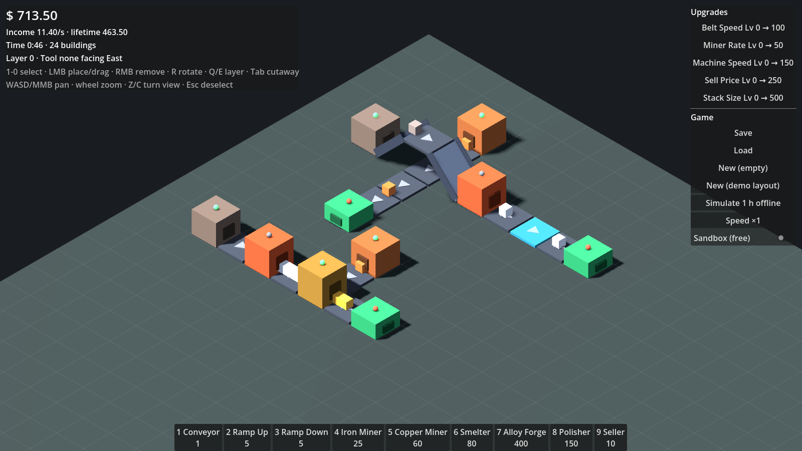

# Factory Sim

A modular factory/tycoon game about automation, resource pipelines and endless
progression. The game logic is a **deterministic, engine-agnostic C# simulation**.
**Godot 4** is one frontend for it; a headless CLI is another.



*The demo layout: iron ore rides a ramp up, crosses a bridge over the copper line,
drops into a smelter, gets polished and sold. The lower line merges two ingredients
in an alloy forge.*

## Repository layout

```
src/FactorySim.Core/     Simulation: grid, entities, transport, machines, economy, saves, offline.
                         Plain .NET 8. No engine references (a test enforces this).
src/FactorySim.Cli/      Headless host: demo walkthrough, ASCII view, benchmark.
tests/FactorySim.Tests/  xUnit tests for the core (belt physics, machines, determinism, saves…).
godot/                   Godot 4.7 (.NET) client: 3D isometric view, building, HUD. Presentation only.
docs/ARCHITECTURE.md     How the pieces fit, and where to extend them.
```

## Quick start

Requires the [.NET 8 SDK](https://dotnet.microsoft.com/download). The Godot client
also needs **Godot 4.7 .NET** (the "mono" download).

```bash
dotnet test                                   # run the core test suite
dotnet run --project src/FactorySim.Cli       # headless demo: ASCII layers, stats, save/load, 8 h offline catch-up
dotnet run --project src/FactorySim.Cli -c Release -- bench 200   # ~6.6k entities, ticks/s
```

**Godot:** open `godot/project.godot` in Godot 4.7 .NET and press Play. Pick
"New (demo layout)" on the right to spawn the demo factory, or build your own.

Headless smoke test (CI-friendly): builds the demo, runs at 16× speed for 3 s, prints stats and exits non-zero if nothing was earned:

```bash
godot --headless --path godot --build-solutions --quit
godot --headless --path godot -- --smoke
```

### Controls (Godot)

| Input | Action |
|---|---|
| `1`–`9`, `0` / toolbar | Select a building (again or `Esc` to deselect) |
| LMB (drag) | Place. Dragging a belt lays a line and turns corners automatically |
| RMB (drag) | Remove (full refund for now) |
| `R` / `Shift+R` | Rotate placement. With no tool selected, rotates the hovered building |
| `Q` / `E` | Build layer down / up (negative = underground) |
| `Tab` | Cutaway: hide everything above the current layer |
| `WASD`, arrows, MMB drag | Pan · wheel zooms · `Z` / `C` turn the view 90° |

The game autosaves every 30 s and on quit. On the next start, time spent away is
caught up (see *Offline progress* in the architecture doc).

## Adding content

Most new content is data. `src/FactorySim.Core/Content/Data/base.json` defines
items, recipes, buildings (footprint, ports, behavior and params) and upgrades.
For example, a faster belt or a machine with a new recipe needs no code. Extra
packs layer on top and override by id:

```csharp
var content = ContentRegistry.LoadDefault(null, ContentRegistry.ParsePack(File.ReadAllText("my_pack.json")));
```

New *kinds* of behavior (e.g. a splitter, a heater with a temperature model) are a
class deriving from `Behavior<TParams, TState>`, registered in `BehaviorRegistry`.
See [docs/ARCHITECTURE.md](docs/ARCHITECTURE.md).
