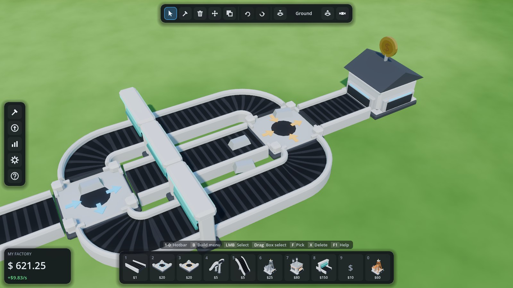
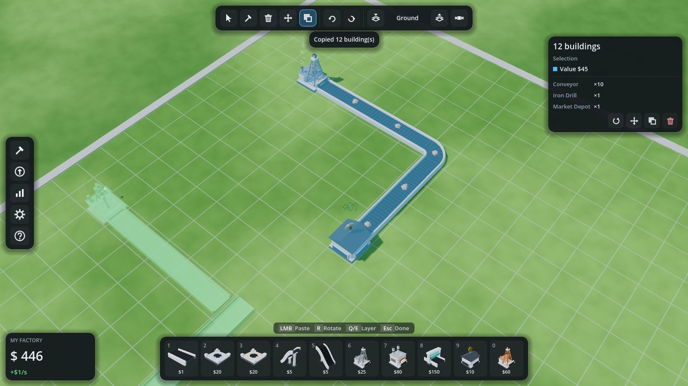

# Factory Sim

A modular factory/tycoon game about automation, resource pipelines and endless
progression. The game logic is a **deterministic, engine-agnostic C# simulation**.
**Godot 4** is one frontend for it; a headless CLI is another.


| Bridges and ramps | Splitters, curves, mergers |
|---|---|
|  |  |
| **Build menu with rendered icons** | **Copy/paste with live ghost preview** |
|  |  |

Every 3D model is **generated in code**: beveled low-poly bodies, belt profiles swept
along curves, lattice towers, and smoking chimneys. Build-menu and hotbar icons are
rendered from those same models, so new content gets art and icons with no asset work.

## Repository layout

```
src/FactorySim.Core/     Simulation: grid, transport, machines, economy, blueprints, undo, saves, offline.
                         Plain .NET 8. No engine references (a test enforces this).
src/FactorySim.Cli/      Headless host: demo walkthrough, ASCII view, benchmark.
tests/FactorySim.Tests/  xUnit tests for the core (belt physics, splitting/merging, editing, determinism…).
godot/                   Godot 4.7 (.NET) client. Presentation and input only.
  scripts/Visual/          procedural models (MeshBuilder, ModelFactory), world view, shaders
  scripts/Input/           camera, build tools, ghost previews
  scripts/UI/              HUD, build menu, inspector, icons, thumbnails
  scripts/Dev/             scripted end-to-end UI test
docs/ARCHITECTURE.md     How the pieces fit, and where to extend them.
```

## Quick start

Requires the [.NET 8 SDK](https://dotnet.microsoft.com/download). The client needs
**Godot 4.7 .NET** (the "mono" download).

```bash
dotnet test                                   # core test suite
dotnet run --project src/FactorySim.Cli       # headless demo: ASCII layers, stats, save/load, offline catch-up
```

**Play:** open `godot/project.godot` in Godot 4.7 .NET and press Play. Pick
*New factory (demo layout)* in the game menu (`G`) to spawn the demo, or start building.

## Building — controls

Building is designed to be fast from the keyboard. Press `F1` in game for this table.

| Keys | Action |
|---|---|
| `1`–`0` | Hotbar building (press again to put it away) |
| `B` | Build menu. Hover a building and press `1`–`0` to put it on the hotbar |
| LMB | Place / select |
| Drag (building) | Lay a line. It forms an L, and belts orient and curve themselves |
| Drag (selecting) | Box select. `Shift` adds, `Ctrl` removes |
| `R` / `Shift+R` | Rotate the placement, the selection, or the hovered building |
| `F` | Pick the hovered building (type + rotation) |
| `Q` / `E`, `Shift+wheel` | Build layer down / up |
| `Tab` | Cutaway: hide layers above the current one |
| `X` | Delete tool (click or drag a box) · `Del` deletes the selection |
| `M` | Move the selection (keeps items on belts) |
| `C` · `Ctrl+C` / `Ctrl+V` / `Ctrl+X` | Copy & paste selection · copy / paste / cut |
| `Ctrl+Z` / `Ctrl+Y` | Undo / redo (a dragged line is one step) |
| `Ctrl+A` | Select all |
| `Esc` / right-click | Cancel the tool, then clear the selection |
| `WASD`, MMB drag · RMB drag · wheel | Pan · orbit · zoom toward the cursor |
| `U` · `I` · `G` · `F1` | Upgrades · statistics · game menu · help |

**Bridges and tunnels need no layer juggling.** Place a *Ramp Up*: the build layer
follows it up, so you keep dragging belts on the upper layer. Place a *Ramp Down* and
you're back on the ground. A ramp down placed on the ground digs into the tunnel layer.
Belts that span empty space get support pillars automatically.

The selection inspector (right) shows status, recipe, buffers and totals, plus
rotate/move/copy/delete buttons. Ghost previews show where items enter (blue) and
leave (orange) a building.

## Testing

```bash
dotnet test                                                     # 59 core tests

# Godot client (headless): build, then a quick smoke run of the demo factory
godot --headless --path godot --build-solutions --quit
godot --headless --path godot -- --smoke

# Scripted end-to-end UI test: injects real mouse/keyboard input (line drag, undo,
# box select, copy/paste, delete, move, pipette, bridge flow) and checks the results.
# Needs a display (e.g. xvfb-run). Add --shots=/abs/dir to save screenshots.
godot --path godot -- --ui-test
```

## Continuous integration and downloads

`.github/workflows/build.yml` runs on every push to `main`:

1. Runs the unit tests (`dotnet test`) and builds the client (`dotnet build godot -c Release`).
2. Exports the Windows build headlessly with Godot 4.7.2 .NET on Linux, using preset
   **Windows Desktop** in `godot/export_presets.cfg`, into `build/`.
3. Uploads `FactorySim-Windows.zip` as a workflow artifact and publishes it on the
   rolling **`latest-build`** pre-release. The latest push from any of those branches wins.

The export is self-contained (it bundles the .NET runtime). Unzip and run `FactorySim.exe`,
keeping the `.pck` and the `data_*` folder next to it. Godot's C# export needs a solution
file. It lives in `godot/sln/` (project setting `dotnet/project/solution_directory`), which
keeps `godot/` itself to a single project file so `dotnet build godot` works.

Export locally with the same command (export templates for 4.7.2 installed):

```bash
cd godot && godot --headless --export-release "Windows Desktop" ../build/FactorySim.exe
```

## Adding content

Most content is data. `src/FactorySim.Core/Content/Data/base.json` defines items,
recipes, buildings (footprint, ports, behavior, params) and upgrades. A building's
`meta.model` picks its procedural model (`belt`, `ramp`, `splitter`, `merger`, `drill`,
`furnace`, `forge`, `polisher`, `depot`), and `meta.accent` tints it. A new machine that
reuses an existing behavior and model therefore needs no code at all. Extra packs
layer on top and override by id:

```csharp
var content = ContentRegistry.LoadDefault(null, ContentRegistry.ParsePack(File.ReadAllText("my_pack.json")));
```

New *kinds* of behavior are a class deriving from `Behavior<TParams, TState>`. New
*looks* are a case in `godot/scripts/Visual/ModelFactory.cs`. See
[docs/ARCHITECTURE.md](docs/ARCHITECTURE.md).
