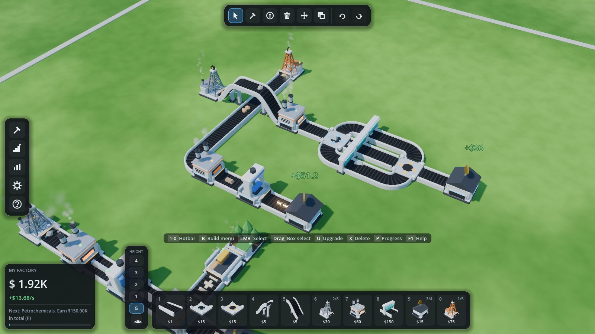
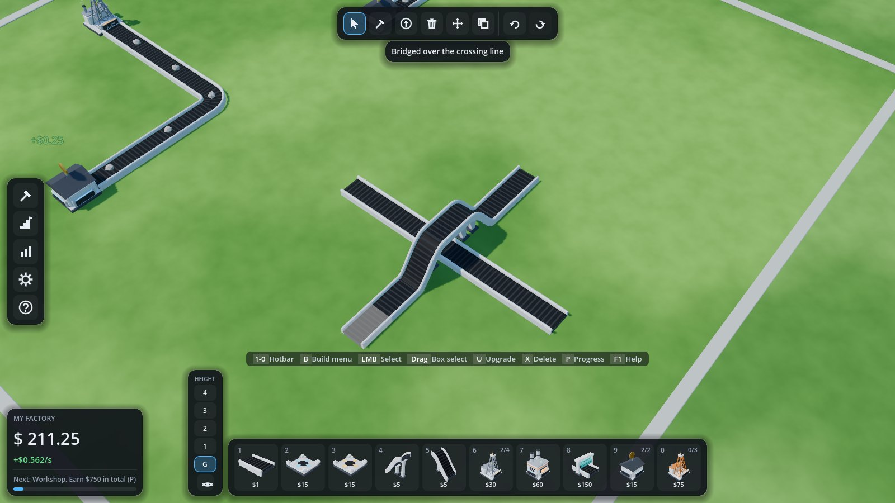
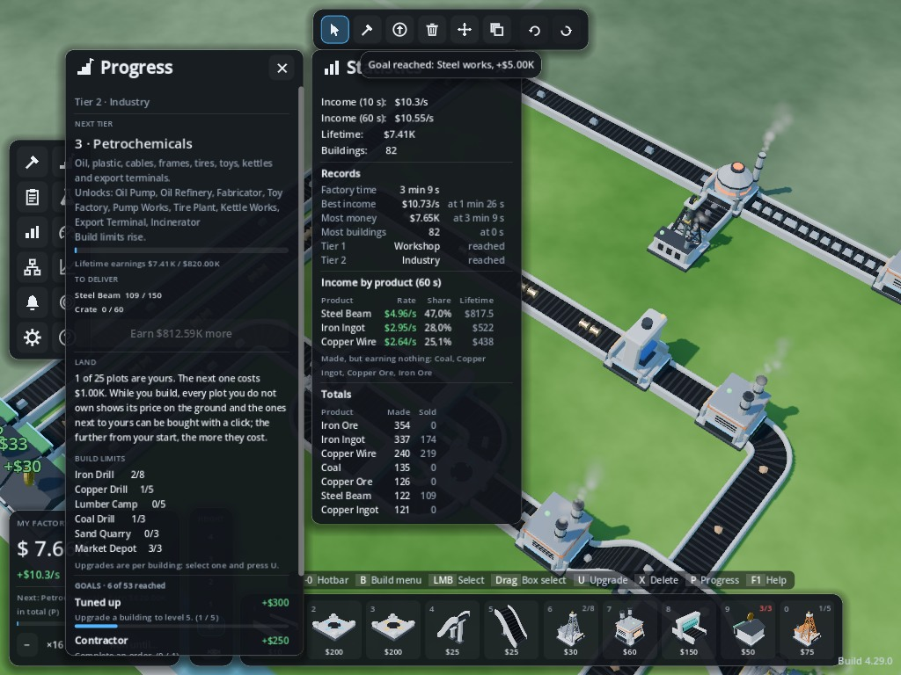
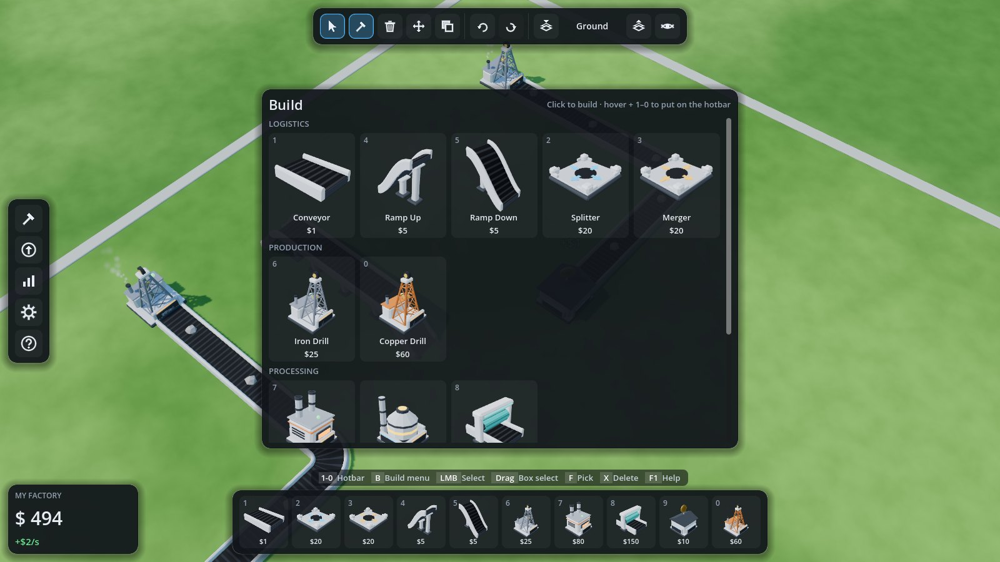
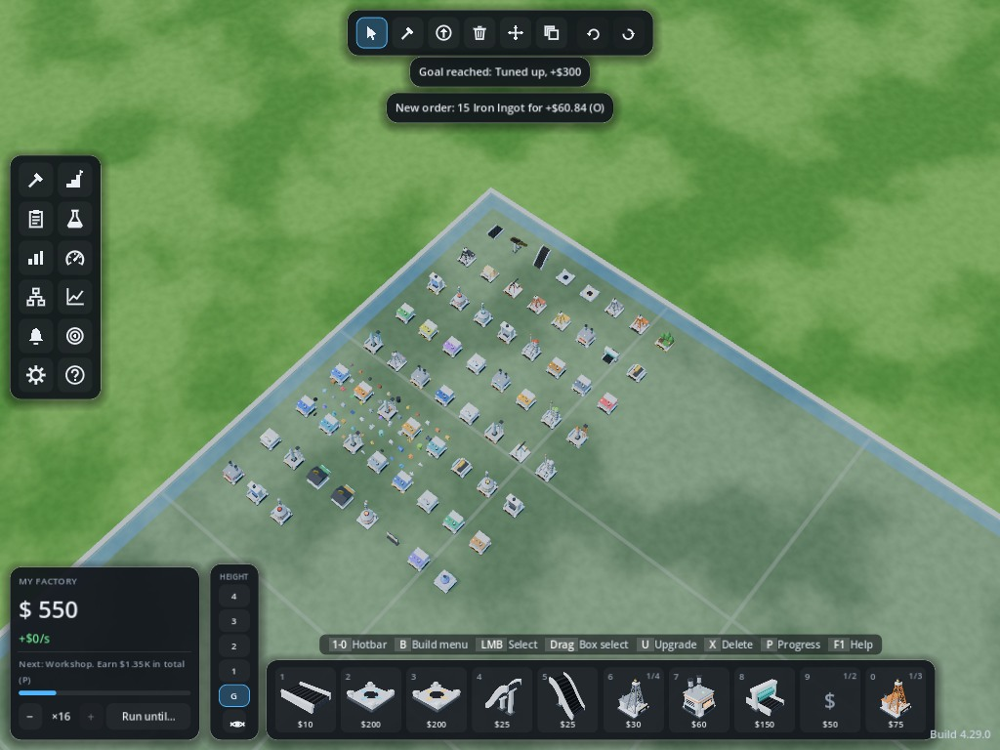

# Vibe Factory

A modular factory/tycoon game about automation, resource pipelines and endless
progression. The game logic is a **deterministic, engine-agnostic C# simulation**.
**Godot 4** is one frontend for it; a headless CLI is another.



| Drag a belt across a line: it bridges itself | Manage a building, choose its recipe; windows side by side |
|---|---|
|  |  |
| **Build menu with rendered icons** | **Every building and item is generated in code** |
|  |  |

Every 3D model is **generated in code**: beveled low-poly bodies, belt profiles swept
along curves, lattice towers, and smoking chimneys. Build-menu and hotbar icons are
rendered from those same models, so new content gets art and icons with no asset work.

The sound is the opposite: **every sound is a real recording**. Placing, removing,
upgrading and selling come from Kenney's CC0 packs (positional, with a little pitch
variation so repeats don't sound mechanical), and chilled lounge music by Kevin MacLeod
plays underneath. See [Credits](#credits).

**A full game around it:** a title screen with your factory running behind it, five save
slots (autosave, play time, last played), a pause menu, a tutorial, a long progression of
eight tiers, customer orders and 29 goals, and settings in four tabs:

- **Audio:** master, music, effects and interface volume; mute when the game is in the background.
- **Display:** fullscreen, vsync, frame rate limit, FPS counter, graphics quality, interface size.
- **Controls:** pan speed, edge panning, inverted zoom, and every key rebindable (click it, press the new one).
- **Gameplay:** autosave interval, money pop-ups over depots, key hints, order and goal pop-ups, replay the tutorial.

## Repository layout

Assemblies and namespaces keep the code name `FactorySim`; the game is called Vibe Factory.

```
src/FactorySim.Core/     Simulation: grid, transport, machines, economy, blueprints, undo, saves, offline.
                         Plain .NET 8. No engine references (a test enforces this).
src/FactorySim.Cli/      Headless host: demo walkthrough, ASCII view, benchmark, balance report.
tests/FactorySim.Tests/  xUnit tests for the core (belt physics, splitting/merging, editing, determinism…)
                         and the client's crash-safe save files.
godot/                   Godot 4.7 (.NET) client. Presentation and input only.
  scripts/Visual/          procedural models (MeshBuilder, ModelFactory), world view, shaders
  scripts/Input/           camera, build tools, ghost previews
  scripts/UI/              HUD, build menu, windows, title and pause menus, icons, thumbnails
  scripts/Audio/           sound effects and music (AudioManager)
  audio/                   recorded sounds and music (see audio/CREDITS.md)
  scripts/Dev/             scripted end-to-end UI test
docs/ARCHITECTURE.md     How the pieces fit, and where to extend them.
tools/                   helper scripts for whoever plays the game (see Updating below).
```

## Quick start

Requires the [.NET 8 SDK](https://dotnet.microsoft.com/download). The client needs
**Godot 4.7 .NET** (the "mono" download).

```bash
dotnet test                                   # core test suite
dotnet run --project src/FactorySim.Cli       # headless demo: ASCII layers, stats, save/load, offline catch-up
dotnet run --project "src/FactorySim.Cli" -- balance        # economy report over the content file
dotnet run --project "src/FactorySim.Cli" -- balance item robot  # what one robot needs, ore to depot
dotnet run --project "src/FactorySim.Cli" -- balance land   # what each ring of plots costs and when you can afford it
```

**Balance tool.** `balance` is a calculator over `base.json`: `balance tiers` estimates how long
each tier takes, `balance items` lists what everything is worth and what uses it, and
`balance item <name> [rate]` breaks down one production line (machines, ores per second, build
cost, payback), and `balance land` prices the map's plots against income (which tier can afford
each ring, and how many minutes of income it is). Options: `--level N` (every building at level N), `--polish none|products|all`,
`--tier N` (what is unlocked), `--pack extra.json` (repeatable). It reads content only, so it can
check a balance change before it ships.

**Download (Windows):** the newest build is always the
[latest release](https://github.com/Fayberr/vibe-factory/releases/latest), direct link:
[VibeFactory-Windows.zip](https://github.com/Fayberr/vibe-factory/releases/latest/download/VibeFactory-Windows.zip).

A push to `main` rebuilds that release. A push that only touches documentation (`docs/`, any `.md`,
`LICENSE`, `.gitignore`) does not, since there is no client to build. Run the
[workflow](https://github.com/Fayberr/vibe-factory/actions/workflows/build.yml) by hand from the
Actions tab to build one of those commits anyway.

**Updating.** [`tools/Update-VibeFactory.cmd`](tools/Update-VibeFactory.cmd) keeps a folder on the
newest build, and it ships inside `VibeFactory-Windows.zip`, so unzipping once is enough to have it.
Keep it in the folder you play from and double-click it: it downloads the current release, replaces
everything in that folder except the script itself, and deletes the zip. It runs unattended, so it
never asks a question, and a clean run closes its own window; it waits only when something went
wrong, so the message can be read. It does not start the game, and it refuses to run while the game
is open (its files cannot be replaced then). Nothing in the folder is deleted until a download has
arrived, passed a size check, and been proved to be a readable archive that actually holds the game,
so a failed or slow download leaves the build you have alone. A folder holding none of the game's own
files is refused rather than emptied, which is what keeps a stray double-click elsewhere harmless.
Saves are not in that folder (Godot keeps them in its own user folder), so they are never touched.

It is also attached to the release on its own as `Update-VibeFactory.cmd`, which downloads as a file.
Do not fetch it from the repository page: GitHub serves it as plain text there, so a browser shows
the script instead of saving it, and saving the page that way leaves an empty file that Windows
cannot run.

**New to it?** A short tutorial walks you through your first factory (drill, belt, smelter,
depot, first upgrade) the first time you play. Reopen it any time from the Game menu (`G`).

**Play from source:** open `godot/project.godot` in Godot 4.7 .NET and press Play. The
title screen has *Continue*, *New factory* (tick *Start with the example factory* for a
ready-made factory), *Load factory*, *Settings* and *Credits*. Saves live in five slots
under Godot's user folder (`user://saves/`); older single saves move into slot 1.

## Building controls

Building is designed to be fast from the keyboard. Press `F1` in game for this table. These
are the default keys: every single-key action can be rebound in *Settings → Controls*.

| Keys | Action |
|---|---|
| `1` to `0` | Hotbar building (press again to put it away) |
| `B` | Build menu. Hover a building and press `1` to `0` to put it on the hotbar |
| LMB | Place / select. Dropping a polisher, splitter or machine on a belt replaces that belt |
| Drag (belts) | The belt finds its own way: the shortest path with the fewest turns, around buildings (as many turns as it takes), over other belt lines (it builds the bridge) and past the spots machines drop items on. Drag from a machine to a machine and it connects the one's output to the other's input; drag into the side of a belt that nothing feeds and it becomes a curve (a belt in a running line does not take belts from its side: use a merger) |
| `Shift`+drag (belts) | Draw the path yourself: the belt follows the mouse, turn after turn. Move back along it to take cells off again |
| Drag (other buildings) | A row of them, as an L |
| Drag (selecting) | Box select. `Shift` adds, `Ctrl` removes |
| `R` / `Shift+R` | Rotate the placement, the selection, or the hovered building |
| `F` | Pick the hovered building (type, rotation and height) |
| `E` / `Q`, `PageUp` / `PageDown`, `Shift+wheel` | Build height up / down (the ladder next to the hotbar shows it) |
| `Tab` | Hide everything above the build height |
| `U` | Upgrade the selection, or open the upgrade tool (click, drag a box, `Shift`-click a whole belt line) |
| `X` | Delete tool (click or drag a box) · `Del` deletes the selection |
| `M` | Move the selection (keeps items on belts; `E`/`Q` lifts or lowers it) |
| `C` · `Ctrl+C` / `Ctrl+V` / `Ctrl+X` | Copy & paste selection · copy / paste / cut |
| `Ctrl+Z` / `Ctrl+Y` | Undo / redo (a dragged line is one step) |
| `Ctrl+A` | Select all |
| `Esc` / right-click | Cancel the tool, then clear the selection |
| `WASD`, MMB drag · RMB drag · wheel | Pan · orbit · zoom toward the cursor |
| `P` · `O` · `I` · `G` · `F1` | Progress (tiers, limits, goals) · orders · statistics · game menu · help. Windows can be open together and stay open until you close them (the same key, or ×); drag them by the title bar |
| `Space` | Pause or resume the factory (you can keep building while it is paused) |
| `Esc` | Cancels the tool, then clears the selection, then opens the pause menu (resume, save, settings, quit to the title screen or to the desktop). Open windows stay open |

**Heights.** Everything is built at the current build height, shown on the ladder next
to the hotbar and next to the cursor. `G` is the ground plate: nothing can go below it.
Belts one level up are bridges and get support pillars automatically. You rarely need
to change height by hand. Drag a belt straight across another line and it builds the
ramp up, the bridge and the ramp down itself. Place a *Ramp Up* and the build height
follows it up. A *Ramp Down* always lands on the ground it stands on.

A tooltip next to the cursor says what a click will do and what it costs. Ghost previews
show where items enter (blue) and leave (orange) a building.

**Manage window.** Click a building to manage it: picture, description, level, value,
speed and status, a big **Upgrade** button (with the price) and **Delete**. Machines show
a grid of everything they can make. Pick one and the machine only takes that recipe's
ingredients, or leave it on *Automatic*. The chosen item shows its parts, value and
time. Select several machines of one kind to upgrade or set them all at once. Copies keep
their choice.

## Progression and balance

- **Tiers.** Eight tiers (Basics, Workshop, Industry, Petrochemicals, Electronics,
  Robotics, Aerospace, Space). Each needs lifetime earnings, a delivery of goods the tier
  before makes (from Industry on) and a price, unlocks new extractors and machines and
  raises build limits. The factory card always shows the next goal; `P` opens the details,
  including what the next tier still wants sold. The late game adds bauxite, aluminium,
  drones, rocket fuel and satellites, and ends at a launch complex.
- **Orders.** Customers post up to three orders (`O`): deliver a quantity of one product
  before the deadline for about twice its value on top of the normal sale. Orders ask
  for things you can already make, sized to your current income, and newer products are
  asked for more often. Small parts (screws, rods) are only offered while income is small
  enough that an order stays a sane number of units. Don't like one? Swap it for a small fee.
- **Goals.** 29 milestones (first sale, 50 conveyors, a level 10 building, 10 orders,
  first robot, first satellite, a trillion earned…), each with a cash reward. The Progress
  window shows the next four with progress bars.
- **Per-building upgrades.** There are no global upgrades. Every building has its own
  level: drills and machines get faster (machines also add a little value), belts and
  splitters go from 4 to 20 items/s over 9 levels, mergers from 3.3 to 20 over 7 (a merger
  runs slower than a belt and spaces items wider, so it is a real throughput gate until it is
  levelled), market
  depots pay more. Ten drills means ten upgrades. Levels show as coloured trims (bronze,
  silver, gold, cyan, violet) and are kept by copy/paste.
- **Raw resources sell for 25%, and every ore is worth the same $1.** An item is worth the
  work in it: what went in times the recipe's multiplier, so processing is what pays, and a
  newer tier builds on the old chains instead of replacing them. Parts feed many recipes
  (plates, rods, screws and gears go into crates, frames, toys, motors and robots), and the
  old dead ends are ingredients now: crates pack toys, toys are robot bodies, jewelry goes
  into satellites. A robot is worth thousands of iron ore.
- **The Polisher pays at the depot.** An in-line machine that multiplies the value of what
  passes it by 1.5, once per item, paid only when the item is sold. Machines value their
  inputs at the plain rate, so polishing an ingredient is wasted: put it right before the
  depot. Raw ore keeps its 25% cut, so polished ore still sells for 1.5× that.
- **Land.** The map is a fixed 5 x 5 grid of plots, each 15 x 15 cells (75 x 75). Everyone starts
  with the one plot at the bottom middle and buys the rest (while you build, move or paste, every plot you do not own shows its price flat on the ground, and the ones next to yours can be bought: click the plot and confirm).
  A plot must share an edge with land you own, never just a corner. The price depends on how far
  the plot is from your starting plot, not on how many you own: the three plots next to the start
  cost the same ($2.5K), and every step further out costs eight times more, up to $82M in the far
  corners. You can only build on your own land; the blue rim around the whole map is where
  depots and export terminals work, so a plot on the map's edge is worth more than its size.
  Sandbox owns the whole map for free.
- **Build limits.** Extractors and depots are capped per tier (for example 4 iron drills
  at the start and 2 more with every tier). Belts and machines are unlimited,
  but logistics is not free: a belt tile costs $10, a ramp $25, a splitter or merger $200.
- **Depots are the bottleneck.** A Market Depot costs $50, takes items in through one side
  only (the blue side, under its green canopy) and there are few of them: 2 at the start,
  one more every second tier. So instead of a depot per drill, you merge lines into them.
  **Depots stand on the edge of the map** (the blue rim), with that input facing your factory: goods leave
  at the rim, and the belts that reach it are the factory's arteries. Placed at the end of a
  belt, a depot turns by itself to take that belt in, which is the way it should face anyway.
  Export Terminals (double price) follow the same rule.

## Testing

```bash
dotnet test                                                     # core and save-file tests (223)

# Godot client (headless): build, then a quick smoke run of the demo factory
godot --headless --path godot --build-solutions --quit
godot --headless --path godot -- --smoke

# Scripted end-to-end UI test: injects real mouse/keyboard input (line drag, undo,
# box select, copy/paste, delete, move, pipette, replace-on-place, auto-bridge, build
# height, upgrades, Manage window, windows, pause, title screen, audio) and checks the
# results. Needs a display (e.g. xvfb-run).
# Add --shots=/abs/dir to save screenshots.
godot --path godot -- --ui-test

# Every building (some upgraded) and every item shape in one scene, for checking models.
godot --path godot -- --smoke --showcase --screenshot=/abs/showcase.png
# Screenshot options: --wait=seconds, --view=yaw,pitch,distance,x,z, --select=x,y (opens
# the Manage window for that cell), --windows (opens Progress and Statistics),
# --orders (opens Progress and Orders), --tutorial (an empty factory at the tutorial's
# first step), --pause (opens the pause menu), --title (the title screen; add
# --menu=settings|controls|new|load|credits to open one of its windows), --tool=<building id>
# (build tool in hand), --drag=x0,y0,x1,y1 (holds a box-select drag over those cells).
```

## Versioning

The version is one line in [`VERSION`](VERSION) at the repository root, in `major.minor.patch` form,
and that file is the only place it is written. The build reads it into every assembly, so the number
the game shows is the number it was compiled with. The client stamps it in a small dim label in the
bottom right corner of the screen, reading `Build 3.8.7`; hovering that label adds the commit the
build came from, which is what a bug report needs to name the exact build.

Bump it by hand when a build is worth telling apart:

- **major**: a change that breaks existing saves or the shape of the game.
- **minor**: new content or a new system.
- **patch**: fixes and balance only.

The starting number was counted back from the history rather than started at zero: the 56 commits
before versioning existed contain 3 changes that reshaped the game, 20 that added something to do or
see, and 33 fixes, which is where 3.7.1 comes from. The next change to land moves it on from there.

CI checks the shape of the file before compiling and names each release after the version, so any
download can be traced back to the commit that made it.

## Continuous integration and downloads

`.github/workflows/build.yml` runs on every push to `main`:

1. Runs the unit tests (`dotnet test`) and builds the client (`dotnet build godot -c Release`).
2. Exports the Windows build headlessly with Godot 4.7.2 .NET on Linux, using preset
   **Windows Desktop** in `godot/export_presets.cfg`, into `build/`.
3. Uploads `VibeFactory-Windows.zip` as a workflow artifact and publishes it as the
   repository's **Latest** release (tag `latest-build`, named after the version, the run number
   and the commit). The previous one is deleted first, so the repo page always shows exactly one
   current build. The latest push from any of those branches wins.

The export is self-contained (it bundles the .NET runtime). Unzip and run `VibeFactory.exe`,
keeping the `.pck` and the `data_*` folder next to it. Godot's C# export needs a solution
file. It lives in `godot/sln/` (project setting `dotnet/project/solution_directory`), which
keeps `godot/` itself to a single project file so `dotnet build godot` works.

Export locally with the same command (export templates for 4.7.2 installed):

```bash
cd godot && godot --headless --export-release "Windows Desktop" ../build/VibeFactory.exe
```

## Adding content

Most content is data. `src/FactorySim.Core/Content/Data/base.json` defines tiers,
items (value, `raw`), recipes and buildings (footprint, ports, behavior, params, tier,
`limit`, `upgrade` track, and `group`/`replaces` for dropping one building onto another).
A building's `meta.model` picks its procedural model (`belt`, `ramp`, `splitter`,
`merger`, `drill`, `treefarm`, `quarry`, `pump`, `furnace`, `forge`, `sawmill`, `press`,
`refinery`, `assembler`, `polisher`, `depot`), and `meta.accent` tints it. A new machine that
reuses an existing behavior and model therefore needs no code at all. Extra packs
layer on top and override by id:

```csharp
var content = ContentRegistry.LoadDefault(null, ContentRegistry.ParsePack(File.ReadAllText("my_pack.json")));
```

New *kinds* of behavior are a class deriving from `Behavior<TParams, TState>`. New
*looks* are a case in `godot/scripts/Visual/ModelFactory.cs`. See
[docs/ARCHITECTURE.md](docs/ARCHITECTURE.md).

## Credits

- **Music:** "Dreamer", "Airport Lounge", "Chill Wave" and "Lobby Time" by Kevin MacLeod
  (incompetech.com). Licensed under Creative Commons: By Attribution 4.0 License,
  http://creativecommons.org/licenses/by/4.0/
- **Sound effects:** [Kenney](https://www.kenney.nl) (Interface Sounds, Impact Sounds,
  Casino Audio, Music Jingles), CC0 1.0.
- **Engine:** [Godot](https://godotengine.org) 4.7 (.NET).

Which clip is used for what, and how the files were converted:
[godot/audio/CREDITS.md](godot/audio/CREDITS.md). The same credits are in the game
(title screen, *Credits*).
