# Gallery

Real screenshots of the client (Godot, 1024x768). The version stamp in the bottom right
corner of each one says which build it was taken from. They are rendered from the running
game, not drawn by hand: the client can pose itself and save a frame, which is the same
machinery the scripted UI test uses (`--screenshot=` and friends, see "Testing" in the
[README](../README.md)).

## The factory

**The demo factory.** The layout a new game can start from: three lines, iron into
ingots into steel, copper into wire, and every line ending at a depot on the rim. The
side panels are the always-there HUD: tools, hotbar, money, speed steps and Run until.

**Bridges build themselves.** Drag a belt across another one and it rises over it with a
ramp on each side. Crossing lines is a tool, not a puzzle.

**Every building and item is generated in code.** Beveled low-poly bodies, belt profiles
swept along curves, lattice towers, smoking chimneys, and one mesh and colour per item.
The same models are rendered into the build-menu and hotbar icons, so new content gets
art with no asset work.

**The build menu.** Rendered icons, prices, what a building makes, build limits, and
locked entries that say what unlocks them. Hover a tile and press 1 to 0 to put it on the
hotbar; start typing to search.

## Running a factory

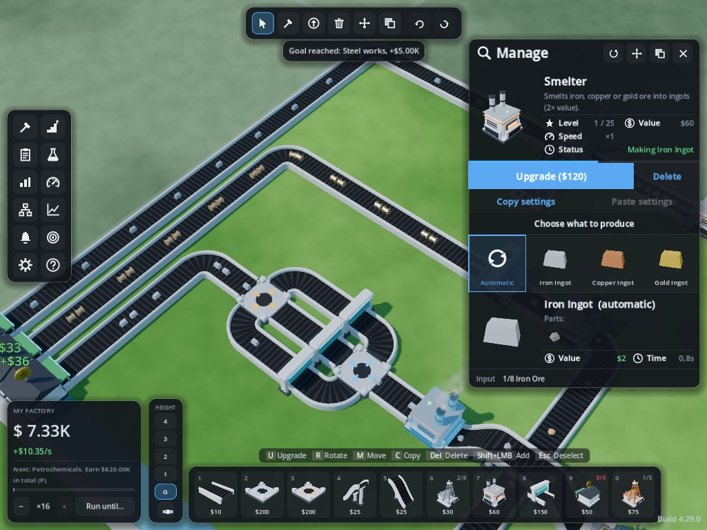

**Manage a building.** Its picture, description, level, speed and value; what it makes
and how much it is worth; the Upgrade button with its price; and the choice of what to
produce, with the parts, value and time of each option.

**Progress and Statistics.** Progress tracks the tier, the deliveries the next tier asks
for, the build limits and the goals. Statistics tracks income, the records of this
factory, income per product, and what was made and sold.

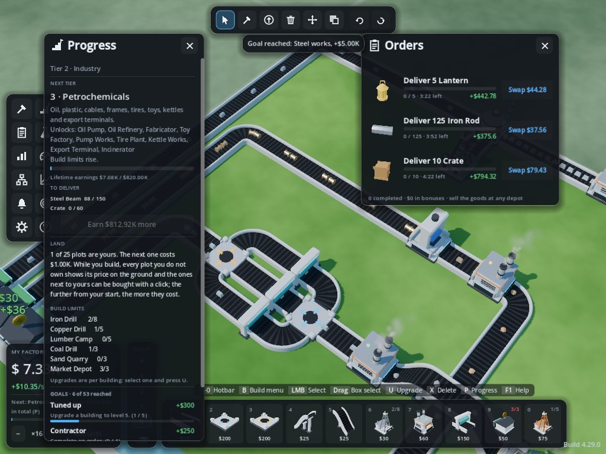

**Orders.** Customers post up to three orders: deliver a product for a bonus, or swap it
for something worth more. They expire, so they are worth watching early on.

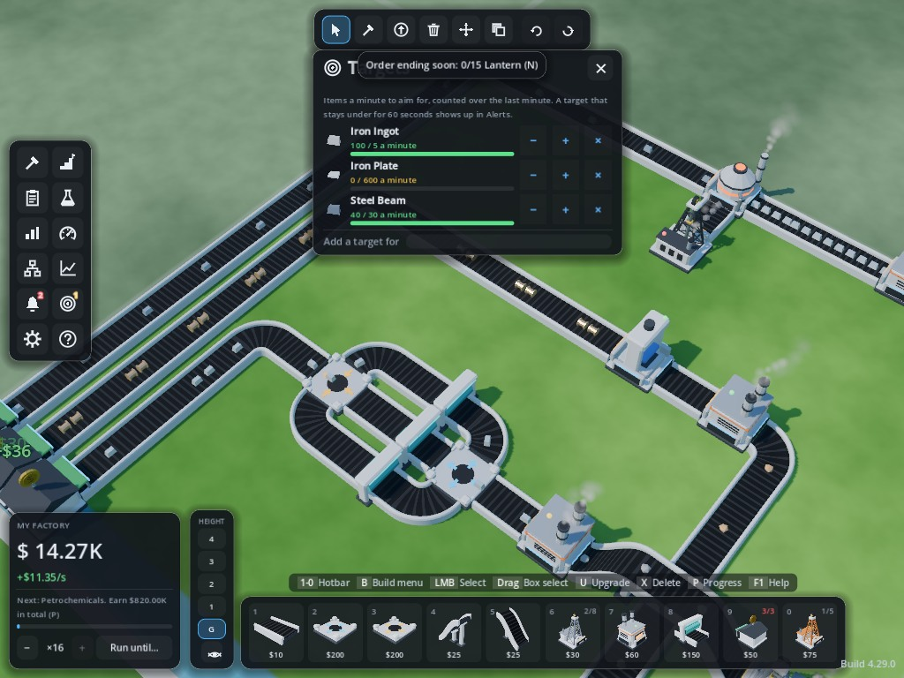

**Production targets.** Ask for so much of a product per minute and watch a progress bar.
A target that is missed for a minute shows up in Alerts.

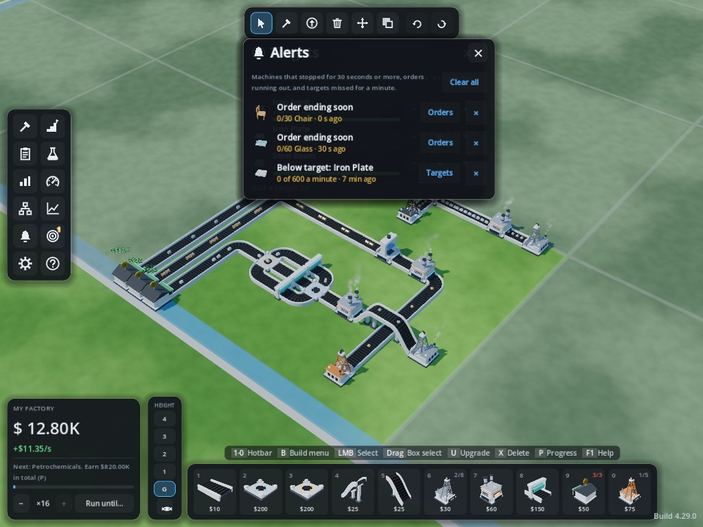

**Alerts.** Machines that stopped for 30 seconds or more, orders running out, targets
missed: one list, with a shortcut to the window that explains each one.

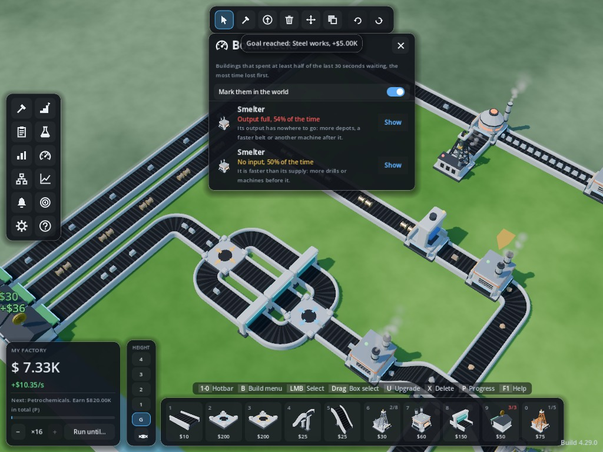

**Bottlenecks.** Which buildings spent at least half of the last 30 seconds waiting, the
worst first, with the reason ("Output full", "No input") and what to do about it. Machines
can be marked in the world.

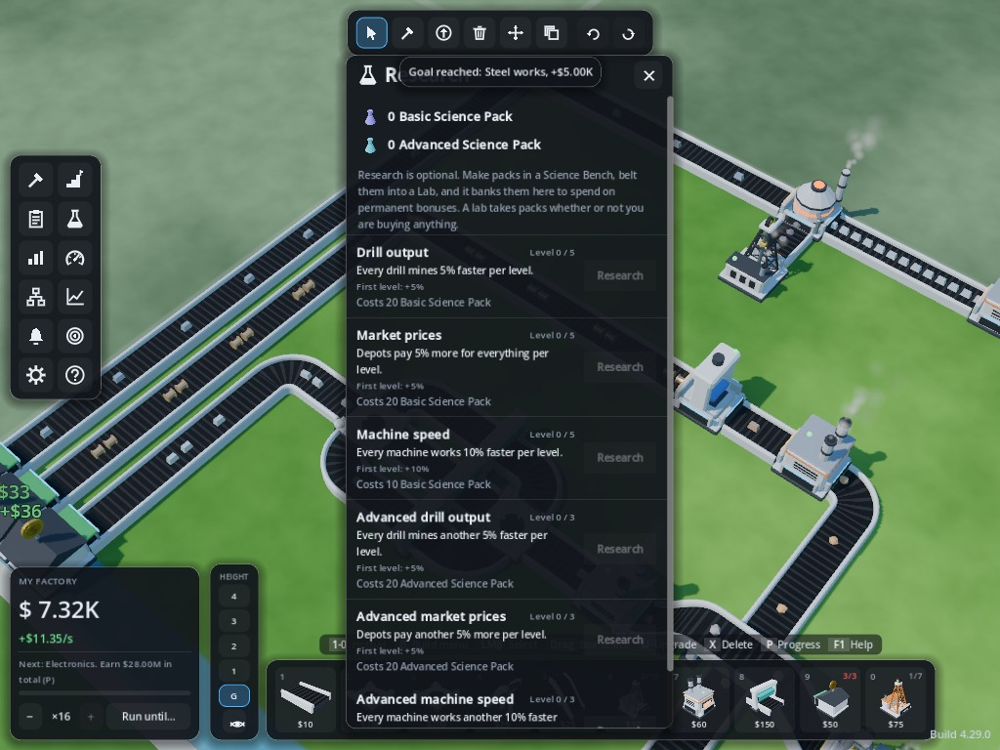

**Research.** Make science packs, belt them into a Lab, and spend them on permanent
bonuses: drill output, market prices, machine speed, and advanced versions of each.

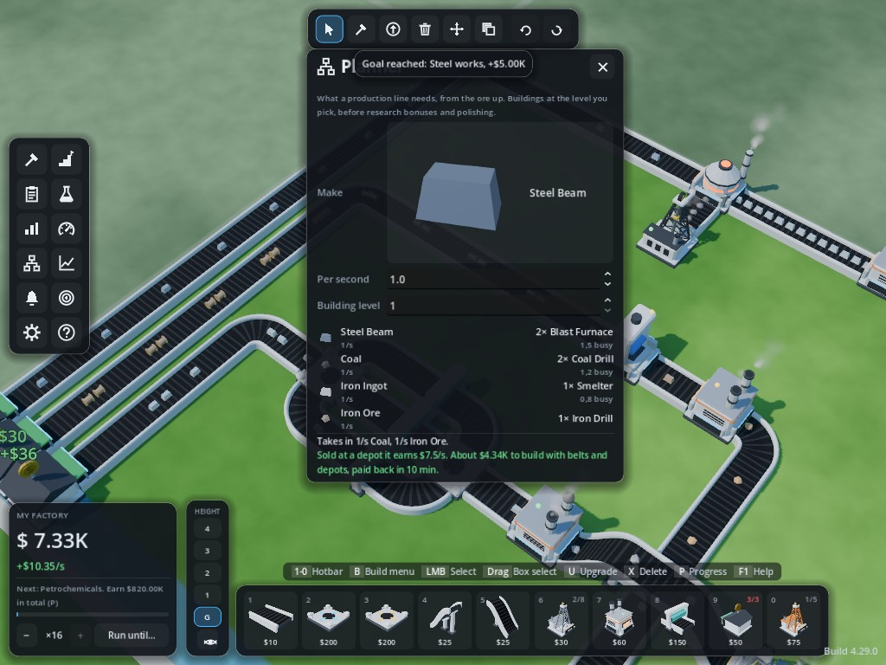

**The line planner.** Pick a product and a rate and it works out the chain: buildings
needed per step, what it costs to build, what it earns at a depot and how long it takes to
pay for itself.

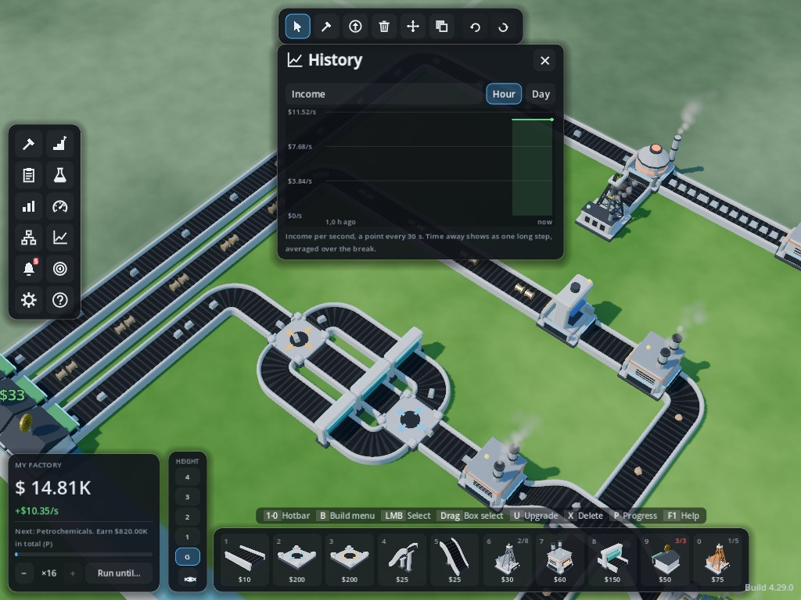

**History.** Income per second or per day, drawn from the save. Time away from the game
shows as one long step, because that is what it is.

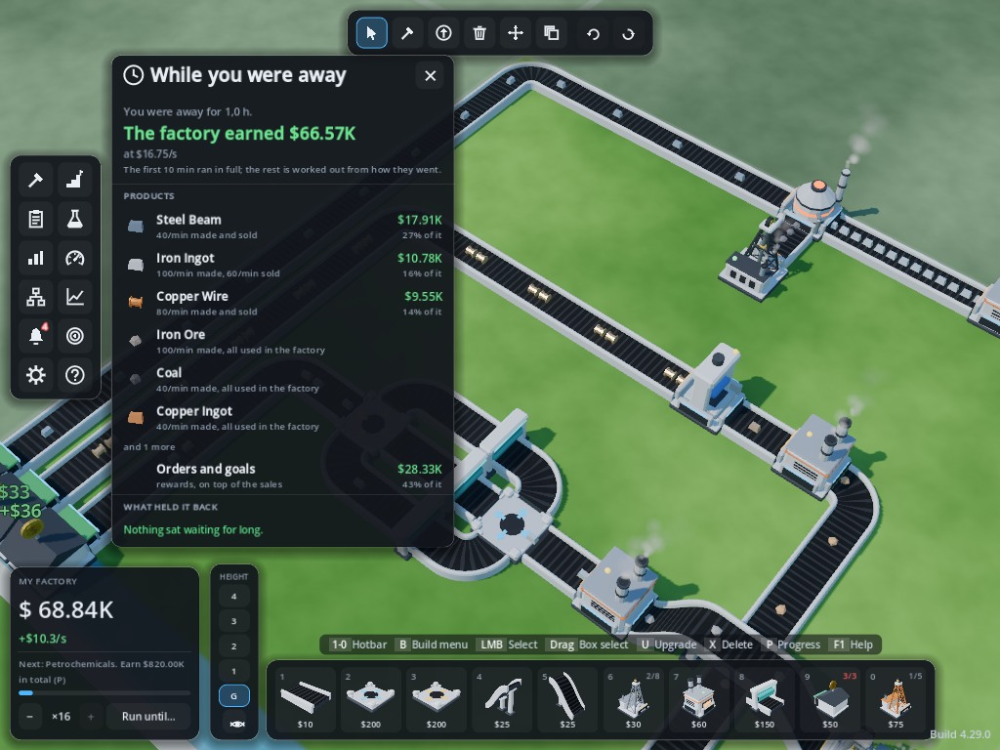

**While you were away.** What the factory earned offline, per product, how much of it came
from orders and goals, and what held it back.

## First steps

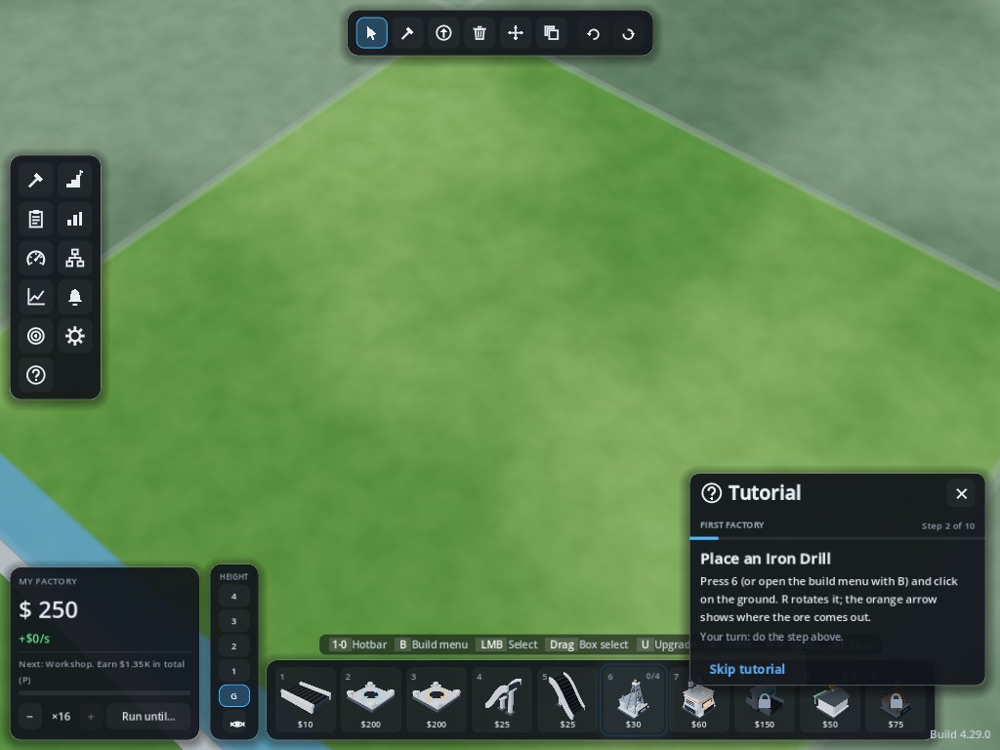

**The tutorial.** Ten steps from placing a drill to a working line, pointing at the hotbar
slot, the build menu and the tool for each step. The world starts empty.

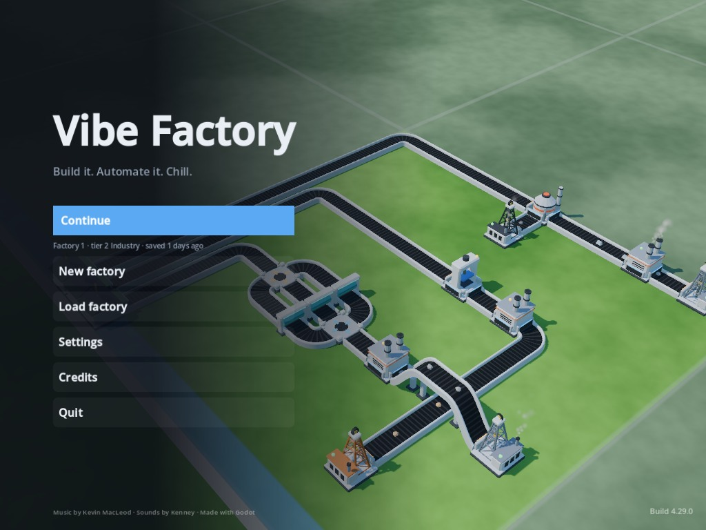

**The title screen.** Continue, new factory, load, settings, credits, over a live factory
backdrop.
